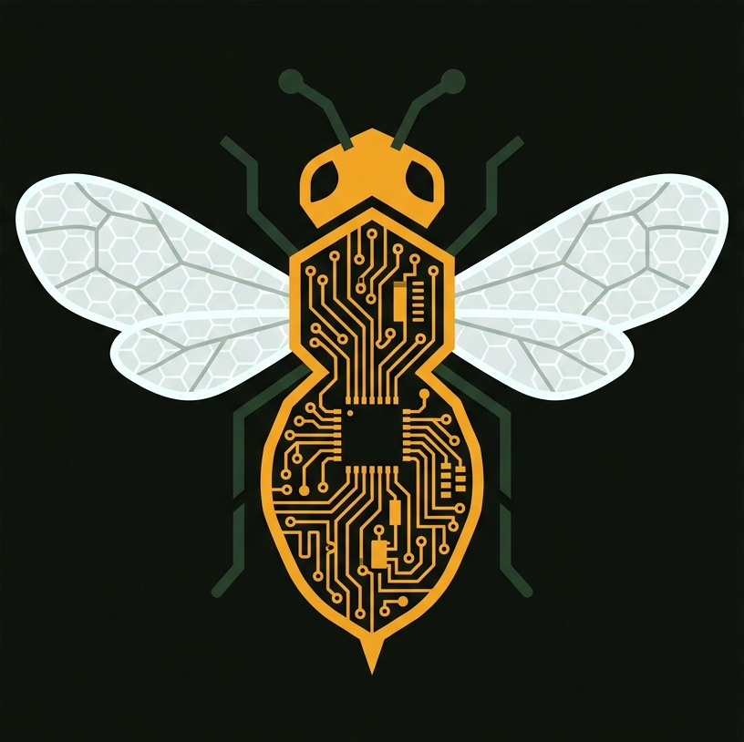

<div align="center">



# BeehiveScale ESP32

**Умные пчелиные весы с ESP32 — автономный мониторинг улья**

🌍 **Язык:** **🇷🇺 Русский** · [🇬🇧 English](README.en.md)


Вес · Температура · Wi-Fi · Telegram · Графики · 26+ дней автономии

[📖 Руководство пользователя](manual.html) · [🔌 Подключение](pages/02_connection.html) · [📱 Telegram](pages/06_telegram.html) · [📋 CHANGELOG](CHANGELOG.md)

</div>

---

## 🐝 О проекте

BeehiveScale — открытый проект пчеловодческих весов для контроля состояния улья без необходимости поднимать его руками. Устройство непрерывно измеряет вес, температуру, отдаёт данные через встроенный сайт и шлёт отчёты в Telegram по расписанию. Работает автономно на 18650/21700 банке несколько недель.

**Для кого:** пчеловоды любого уровня, от любителей с одним ульем до пасек на 100+ ульев. Простой DIY-проект, повторяется на макетной плате за вечер. Полная инструкция, схемы подключения, готовая прошивка.

**Историческая справка:** проект начинался в 2024 году на ESP8266 NodeMCU (v1.x–v4.x). В мае 2026 портирован на ESP32-WROOM-32 (v5.0.0+) — из-за невозможности реализовать стабильный deep sleep на ESP8266 в нашей схеме. ESP32 даёт точное расписание, мощный Wi-Fi, Bluetooth (для будущих фич) и в 3 раза больше Flash под код.

---

## ✨ Возможности

- ⚖ **Точное измерение веса** — HX711 с EMA-сглаживанием, спайк-фильтром, авто-фиксацией стабильных показаний. Точность ±10 г при калибровке.
- 🌡 **Температура** — DS18B20 (улей) + DS3231 RTC (воздух в корпусе). Влагозащищённый зонд в улей.
- 🕐 **Точное время** — DS3231 RTC с CR2032 на годы. Не сбивается при выключении.
- 🌐 **Веб-панель** — встроенный сайт с тёмной темой, графиками, мобильной вёрсткой. Wi-Fi AP или подключение к домашнему роутеру (STA).
- 📅 **Архив с пресетами** — история по дням за период (день/неделя/месяц/всё/с прошлого визита), маркеры аномалий, скачивание CSV.
- 📲 **PWA** — установка сайта как приложения на главный экран Android/iOS, offline-кеш.
- 📱 **Telegram-отчёты** — по расписанию (например 09:00 + 21:00). Работает у любого провайдера благодаря Cloudflare Worker-релаю (обход блокировки `api.telegram.org`).
- 💤 **Deep Sleep + расписание** — ESP32 просыпается в заданное время, делает замер, шлёт отчёт, снова в сон. **20-44 дня автономии** на 21700.
- 🔋 **Мониторинг батареи** — делитель напряжения R1+R2 100к на GPIO34 ADC. Процент заряда и алерт при <10%.
- 📟 **8 экранов LCD** — вес, дельта Δ, батарея, температура, дата/время, статус системы, меню CF, диагностика.
- 🔘 **Управление кнопками** — MAIN (тара/калибровка), MENU (навигация). Защита от случайного нажатия в улье.
- 🩺 **Самопроверка** — диагностический экран тестирует HX711, DS18B20, RTC, батарею.

---

## 📷 Скриншоты

<details>
<summary>Главная страница сайта</summary>

Главная: текущий вес, дельты (от точки + с прошлого замера), температура, батарея, статус системы, мини-график веса, блок «Информация об улье» (сезон, мин/макс веса/темп. за день, точек сегодня, дней наблюдений).

</details>

<details>
<summary>Вкладка Архив</summary>

Архив: пресеты периода (сегодня / 3 дня / неделя / месяц / всё / **«С прошлого визита»** ⭐), лента дней с маркерами аномалий (🔴 при падении больше alert_delta), сводка за период, скачивание CSV.

</details>

<details>
<summary>Telegram-отчёт</summary>

```
📊 Отчёт: улей
🕐 Время: 08.05.2026 21:00:10
⚖️ Вес: 4.42 кг
🎯 Эталон: 4.08 кг (зафикс. 05.05, 3 дн назад)
🎯 От зафикс. точки: +0.34 кг
📈 С прошлого замера: +0.02 кг
🌡 Температура: 27.5 °C
🔋 Батарея: 3.85 В (78 %)
```

</details>

---

## 🧩 Компоненты

| Что | Модель | Количество | Цена ориентировочно |
|---|---|---|---|
| Микроконтроллер | ESP32-WROOM-32 DevKit V1 (DOIT, USB-C) | 1 | ~500 ₽ |
| АЦП тензодатчика | HX711 | 1 | ~50 ₽ |
| Тензодатчик | Балочный TAL220 (50 кг) | 1–4 | ~200 ₽ |
| Дисплей | LCD 1602 + I²C backpack (PCF8574, 0x27) | 1 | ~200 ₽ |
| Термометр | DS18B20 (водозащ. зонд 1м) | 1 | ~150 ₽ |
| RTC | DS3231 + CR2032 | 1 | ~150 ₽ |
| Кнопки | Тактовые 6×6 мм | 2 | ~20 ₽ |
| Питание | TP4056 + MT3608 + 18650/21700 | 1 комплект | ~200 ₽ |
| Резисторы | 100 кΩ ×2 (делитель), 4.7 кΩ (DS18B20 pullup), 10 кΩ (HX711 SCK pullup) | 4 | копейки |
| Корпус | IP65 пластик ~85×65×30 мм | 1 | ~300 ₽ |

**Итого ~2000 ₽** на одни весы.

---

## 📌 Распиновка ESP32

```
ESP32-WROOM-32 DevKit V1
├─ D16 ─ HX711 DT          ┐
├─ D17 ─ HX711 SCK         │ + 10kΩ pullup → 3V3 ⚡ обязательно для sleep
├─ D21 ─ I²C SDA           ┐
├─ D22 ─ I²C SCL           ┘ LCD 0x27 + DS3231 0x68
├─ D33 ─ DS3231 SQW          ↳ опц. задел на P3 (alarm wake)
├─ D4  ─ DS18B20 DATA       + 4.7kΩ pullup → 3V3
├─ D27 ─ Кнопка MAIN        RTC GPIO (wake-from-sleep)
├─ D26 ─ Кнопка MENU
├─ D34 ─ Делитель батареи   ADC1_CH6 (input only)
├─ VIN ─ 5В от MT3608/AS21
└─ 3V3 ─ HX711, DS3231, DS18B20
```

Полная таблица: [`hardware/pinout.md`](hardware/pinout.md). SVG-схема подключения: [`pages/02_connection.html`](pages/02_connection.html).

---

## 🚀 Установка прошивки

### Arduino IDE

```
Tools → Board → ESP32 Arduino → DOIT ESP32 DEVKIT V1
Tools → Partition Scheme → Huge APP (3MB No OTA / 1MB SPIFFS)  ⚠ обязательно!
Tools → Upload Speed → 921600
```

Библиотеки (через Менеджер):
- `arduino-esp32` 2.0.x / 3.0.x
- `LiquidCrystal_I2C` 1.1.2+
- `HX711` by bogde 0.7.5+
- `OneWire` 2.3+, `DallasTemperature` 3.9+
- `RTClib` by Adafruit 2.1+
- `ArduinoJson` **6.x** (не 7.x!)

Открыть → `BeehiveScale/BeehiveScale.ino` → Загрузить.

### PlatformIO

```bash
pio run -e esp32dev -t upload
```

`platformio.ini` уже настроен (huge_app partition, esp32dev environment).

---

## 🌐 Использование

1. **Подключи питание** через TP4056 (заряд) + MT3608 (Boost 5В) → VIN ESP32.
2. **На LCD** появится splash «Vesy Pchelovod v5.0.17».
3. **На телефоне** найди Wi-Fi сеть `BeehiveScale`, пароль `12345678`.
4. **Открой в браузере** `http://192.168.4.1`. Логин `admin` / `beehive`.
5. **Откалибруй** через сайт → Калибровка → поставь гирю → введи вес → Сохранить.
6. **Настрой расписание** в Настройках (например 09:00 и 21:00).
7. **Включи Telegram** — настрой Token (от @BotFather) и Chat ID (от @userinfobot).
8. **Установи на главный экран** — сайт это PWA, иконка пчелы появится среди приложений.
9. **Поставь в улей** — на одной зарядке 21700 живёт 20-26 дней (с MT3608) или 40+ дней (с HT7333 LDO).

Подробно: [📖 руководство пользователя](manual.html).

---

## ⚡ Энергопотребление

| Конфигурация | Sleep | Автономия 21700 (4500 мА·ч) |
|---|---|---|
| Базовая (AMS1117 + AS21) | ~10 мА | ~13 дней |
| + HT7333 LDO + LED'ы выпаяны | ~7 мА | ~19 дней |
| + Pull-up 10к на SCK HX711 | ~5 мА | ~26 дней |
| + MT3608 вместо AS21 | ~4 мА | ~33 дня |
| + P-MOSFET для LCD off в sleep | ~2 мА | ~65 дней 🎯 |

**Замеры подтверждены на железе.** Pull-up на SCK HX711 даёт +12 дней автономии за один резистор за копейки.

---

## 🛠 Технический стек

**Hardware:**
- ESP32-WROOM-32 (Tensilica Xtensa LX6 dual-core 240 МГц, Wi-Fi 802.11 b/g/n, Bluetooth 4.2 BLE, 4 МБ Flash, 520 КБ SRAM)
- HX711 (24-bit ADC for load cells, gain 128)
- LCD HD44780 16×2 через PCF8574 I²C-extender
- DS3231 (TCXO RTC, ±2 мин/год)
- DS18B20 (1-Wire digital temperature, 12-bit)

**Firmware:**
- Arduino Framework on ESP32 core 2.0/3.0
- ArduinoJson 6.x
- bogde/HX711, DallasTemperature, RTClib, LiquidCrystal_I2C

**Cloud:**
- Cloudflare Workers (Telegram-релай) — `beehive-relay.darkvolg.workers.dev`
- Bypass for blocked `api.telegram.org` in some Russian ISPs

**Storage:**
- LittleFS (внутренний flash ESP32) для CSV-лога замеров
- EEPROM-эмуляция для калибровки, паролей, расписания, эталонного веса

---

## 📚 Документация

| Документ | Описание |
|---|---|
| [📖 manual.html](manual.html) | Полное руководство пользователя — 11 вкладок (компоненты, распиновка, прошивка, веб, расписание, Telegram, FAQ) |
| [🔧 pages/01_components.html](pages/01_components.html) | Подробный список компонентов |
| [🔌 pages/02_connection.html](pages/02_connection.html) | Схема подключения, SVG-диаграммы |
| [⚙ pages/03_settings.html](pages/03_settings.html) | Настройки прошивки, EEPROM-карта |
| [🖥 pages/04_operation.html](pages/04_operation.html) | Управление кнопками, 8 экранов LCD |
| [🌐 pages/05_web.html](pages/05_web.html) | Веб-интерфейс, API-эндпоинты, PWA |
| [📱 pages/06_telegram.html](pages/06_telegram.html) | Настройка Telegram через CF Worker |
| [🩺 pages/07_troubleshooting.html](pages/07_troubleshooting.html) | Диагностика и FAQ |
| [📋 hardware/pinout.md](hardware/pinout.md) | Полная распиновка с цветами проводов |
| [📋 CHANGELOG.md](CHANGELOG.md) | История изменений по версиям |
| [🎨 hardware/pcb_layout_v1.excalidraw](hardware/pcb_layout_v1.excalidraw) | PCB-схема (Excalidraw) |

---

## 🔮 Roadmap

- [x] Порт с ESP8266 на ESP32 (v5.0.0)
- [x] Cloudflare Worker для Telegram (v5.0.0)
- [x] Графики на сайте с тач-курсором (v5.0.13)
- [x] Вкладка Архив + PWA (v5.0.16)
- [x] Пресет «С прошлого визита» (v5.0.17)
- [ ] **Фаза P3:** DS3231 alarm wake вместо timer wakeup (точность ±2 мин/год)
- [ ] **Фаза P4:** PCB v2, IP65 корпус, P-MOSFET для LCD off
- [ ] Солнечная панель 5W 6V + MPPT (CN3791)
- [ ] HTTPS на сайте (mTLS)
- [ ] GSM-модуль для пасек без Wi-Fi
- [ ] Графики в архиве (сейчас только сводка)

---

## 📝 Лицензия

MIT — делайте что хотите, главное оставьте ссылку на оригинал. См. [LICENSE](LICENSE).

---

## 🤝 Контрибьюторы

- **Геннадий Якубовский** (@darkvolg) — автор проекта, hardware, тесты на реальной пасеке
- **Claude (Anthropic)** — co-author, прошивка ESP32 порт, веб-панель, документация

Помог проект? Поставь ⭐ на GitHub. Нашёл баг или хочешь добавить фичу — issues и PR welcome.

---

<div align="center">

🐝 **Сделано для пасечников, которые хотят знать о своих пчёлах больше**

[GitHub](https://github.com/darkvolg/BeehiveScale-ESP32) · [Issues](https://github.com/darkvolg/BeehiveScale-ESP32/issues)

</div>
